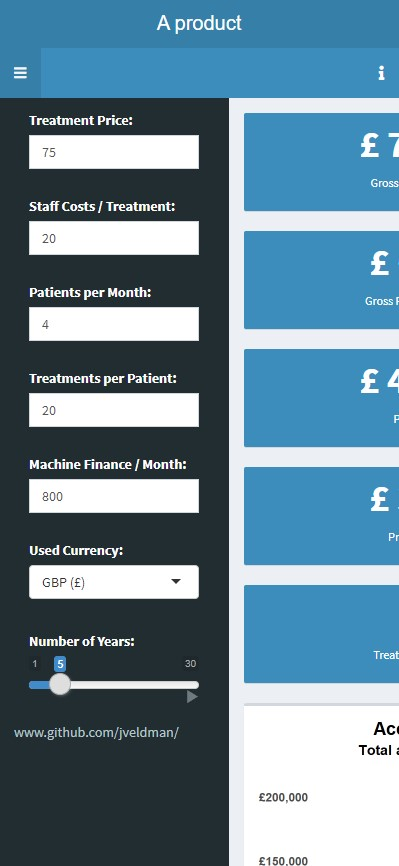

# Profit_Calculator

    <a href="https://jvldmn.shinyapps.io/Profit_Calculator/">https://jvldmn.shinyapps.io/Profit_Calculator/</a>
    

 

Profit_Calculator is a Shiny dashboard used in sales for potential clients. The dashboard shows the potential revenues clients could make when investing in a specific product. After filling in the applicable settings, the dashboard calculates: 
* Monthly \& yearly gross revenue 
* Monthly \& yearly profit
* Accumulated profit over an indicated amount of years
* Monthly revenue divided over profit, machine- and staff costs

## Usage

The dashboard automatically adapts to your device. Therefore, using it on your desktop gives a slightly different interface than using it on your mobile. 

### Desktop:

The dashboard opens with a welcoming message from the salesperson. Once read, click "OK" or somewhere around the pop-up message. 

The settings of the dashboard are located in the black bar on the left of the dashboard. Here you can insert your company's costs and revenues in either euro's, dollars, pounds or Swiss francs. Don't forget to change your currency by clicking on the bar under *"Used Currency:"*. Changing the currency will get the most recent exchange rates which are used to calculate the monthly payments for the product. The dashboard will recalculate revenues, profits costs and exchange rates as soon as you start changing values. 

The settings bar can be hidden by clicking the &equiv; symbol near the top-right of the black bar. Missed the introduction message? Click on the **i** in the top-right corner of the dashboard to get it back. 

### Mobile

The welcome message fills the screen when opening the dashboard. Make it disappear by tapping "OK" or below the message to make it disappear. 

The settings panel is hidden in the mobile interface. Again press the &equiv; button to hide or display the settings panel. The settings work the same as in the mobile interface. The **i** button on the right again makes the welcome message appear again.

    

